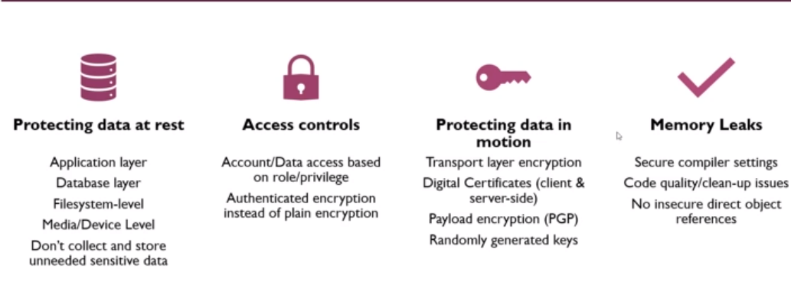

<!-- Intro to SSDLC & Security Definitions -->

<!-- Application Security Introduction -->
`Application Security Introduction`
# Section 2: Welcome!
## SDLC (Software/System Development Life Cycle)

&nbsp;

## Input
- Requirements
- Business Process
- Business Rules
- Software Design
- Specification

&nbsp;

## Output
- Deliverable Code

&nbsp;

## Static Analysis
- Code testing

&nbsp;

## Dynamic Analysis
- Running software testing

&nbsp;

## Unit Testing
- Verify the functionality of specific code

&nbsp;

## Integration Testing Components
- Verify the interfaces between components

&nbsp;

## Interface Testing
- Testing data passed between units

&nbsp;

## System Testing
- Testing a completely integrated system

&nbsp;

---

<!-- Application Security Goals -->
`Application Security Goals`

## Confidentiality
- Information is only available to those who should have access
- When we protect something that provides access value, we are maintaining its confidentiality

&nbsp;

## Integrity
- Data is known to be correct and trusted
- When we protect something that holds its value, we are maintaining its integrity

&nbsp;

## Availability
- Information is available for use by legitimate users when it is needed
- When we protect something that produces value, we are maintaining its availability

&nbsp;

---

<!-- Introduction to OWASP Top 10 -->
`Introduction to OWASP`
# Section 3: Introduction To OWASP Top 10 And More Terms

| **OWASP Top 10 - 2021**                           |
| ------------------------------------------------- |
| _A01: Broken Access Control_                      |
| _A02: Cryptographic Failures_                     |
| _A03: Injection_                                  |
| _A04: Insecure Design_                            |
| _A05: Security Misconfiguration_                  |
| _A06: Vulnerable and Outdated Components_         |
| _A07: Identification and Authentication Failures_ |
| _A08: Software and Data Integrity Failures_       |
| _A09: Security Logging and Monitoring Failures_   |
| _A10: Server-Side Request Forgery_                |

&nbsp;

## 1. Broken Access Control
- Restrictions on what authenticated users are allowed to do are often not properly enforced. Attackers can exploit these flaws to access unauthorized functionality and/or data, such as access other users' accounts, view sensitive files, modify other users' data, change access rights, etc.

&nbsp;

## 2. Cryptographic Failures
- Failure to sufficiently protect data in transit or rest from exposure to unauthorized individuals. This can include poor usage of encryption or the lack of encryption all together.

&nbsp;

## 3. Injection
- Injection flaws, such as SQL, NoSQL, OS, and LDAP injection, occur when untrusted data is sent to an interpreter as part of a command or query. The attacker's hostile data can trick the interpreter into executing unintended commands or accessing data without proper authorization.

&nbsp;

## 4. Insecure Design
- Failing to build security into the application early in the design process through a process of threat modelling, and secure design patterns and principles

&nbsp;

## 5. Security Misconfiguration
- Security misconfiguration is the most commonly seen issue. This is commonly a result of insecure default configurations, incomplete or ad hoc configurations, open cloud storage, misconfigured HTTP headers, and verbose error messages containing sensitive information. Not only must all operating systems, frameworks, libraries, and applications be securely configured, but they must be patched/upgraded in a timely fashion.

&nbsp;

## 6. Vulnerable and Outdated Components
- Components, such as libraries, frameworks, and other software modules, run with the same privileges as the application. If a vulnerable component is exploited, such an attack can facilitate serious data loss or server takeover. Applications and APIs using components with known vulnerabilities may undermine application defenses and enable various attacks and impacts.

&nbsp;

## 7. Identification and Authentication Failures
- Application functions related to authentication and session management are often implemented incorrectly, allowing attackers to compromise passwords, keys, or session tokens, or to exploit other implementation flaws to assume other users' identities temporarily or permanently.

&nbsp;

## 8. Software and Data Integrity Failures
- Code or infrastructure that does not properly protect against integrity failures like using plugins from untrusted sources that can lead to a compromise.

&nbsp;
## 9. Insufficient Logging and Monitoring
- Insufficient logging and monitoring, coupled with missing or ineffective integration with incident response, allows attackers to further attack systems, maintain persistence, pivot to more systems, and tamper, extract, or destroy data. Most breach studies show time to detect a breach is over 200 days, typically detected by external parties rather than internal processes or monitoring.

&nbsp;

## 10. Server-Side Request Forgery
- SSRF occurs when an application fetches resources without validating the destination URL. This can be taken advantage of by an attacker who is able to enter a destination of their choosing.

&nbsp;

## Flagship
- The OWASP Flagship designation is given to projects that have demonstrated strategic value to OWASP and application security as a whole.

&nbsp;

## Lab
- OWASP Labs projects represent projects that have produced a deliverable of value

&nbsp;

## Incubator
- OWASP Incubator projects represent the experimental playground where projects are still being fleshed out, ideas are still being proven, and development is still underway.

&nbsp;

## Low Activity
- These projects had no releases in at least a year, however have shown to be valuable tools Code [Low Activity] Health Check February 2016

&nbsp;

---

<!-- SANS Top 25 -->
`SANS Top 25`
## SANS Top 25 

&nbsp;

## Examples in the Top 25

&nbsp;

---

<!-- Threat actors and more definitions -->
`Threat actors and more definitions`
## Confidentiality
  - Concept of preventing the disclosure of information to unauthorized parties

&nbsp;

## Integrity
  - Refers to protecting the data from unauthorized alteration

&nbsp;

## Availability
  - Access to systems by authorized personnel can be expressed as the system's availability

&nbsp;

## Authentication 
  - Authentication is the process of determining the identity of a user

&nbsp;

## Authorization
  - Authorization is the process of applying access control rules to a user process, determining whether or not a particular user process can access an object

&nbsp;

## Accounting (audit)
  - Accounting is a means of measuring activity

&nbsp; 

## Non-Repudiation
  - Non-repudiation is the concept of preventing a subject from denying a previous action with an object in a system

&nbsp; 

## Least Privilege
  - Subject should have only the necessary rights and privileges to perform its current task with no additional rights and privileges

&nbsp;

## Separation of Duties
  - Ensures that for any given task, more than one individual needs to be involved

&nbsp;

## Defense in Depth 
  - Defense in depth is also known by the terms layered security (or defense) and diversity defense

&nbsp;

## Fail Safe
  - When a system experiences a failure, it should fail to a safe state. (Doors open when there is a power failure)

&nbsp;

## Fail Secure
  - The default state is locked or secured. So a fail secure lock locks the door when power is removed

&nbsp;

## Single point of failure
  - A single point of failure is any aspect of a system that, if it fails, the entire system fails

&nbsp;

## Script Kiddies
  - Low skill
  - Looking for easy and simple attacks
  - Motivated by revenge or fame

&nbsp;

## Hacktivist
  - Moderate to high skill
  - Looking to make an example of an organization
  - Motivated by activism

&nbsp;

## Hackers 
  - High skill
  - Looking to understand how things work 
  - Motivation varies

&nbsp;

## Cyber Criminals
  - High skill
  - Looking for financial exploits 
  - Motivated for money
    * Ransomware
    * Cryptojacking

&nbsp;

## Advanced Persistent Threat
  - Very high skill, deep pockets
  - Looking to commit cyber attacks in order to weaken a political adversary
  - Driven largely by national interest

&nbsp;

## Defense Effort Against Threat Actors

&nbsp;

# Identifying Vulnerabilities

## CVE - Common Vulnerabilities and Exposure
  - Common Vulnerabilities and Exposure is a list of common identifiers for publicly known cyber security vulnerabilities
  - One identifier for one vulnerability with one standardized description
  - A dictionary rather than a database
  - The way to interoperability and better security coverage
  - A basis for evaluation among services, tools and databases
  - Industry-endorsed via the CVE Numbering Authorities, CVE Board, and numerous products and services that include CV

&nbsp;

## CVSS - The Common Vulnerability Scoring System
  - The Common Vulnerability Scoring System provides a way to capture the principal characteristics of a vulnerability and produce a numerical score reflecting its severity. The numerical score can then be translated into a qualitative representation (such as low, medium, high, and critical) to help organizations properly assess and prioritize their vulnerability management processes

&nbsp;

## CWE - Common Weakness Enumeration
  - Common Weakness Enumeration is a community-developed list of common software security weaknesses. It serves as a common language, a measuring stick for software security tools, and as a baseline for weakness identification, mitigation, and prevention efforts. 

  - At its core, the Common Weakness Enumeration is a list of software weaknesses types
  
  - Three types:
    * **Research** - This view is intended to facilitate research into weaknesses, including their inter-dependencies and their role in vulnerabilities
    * **Development** - This view organizes weaknesses around concepts that are frequently used or encountered in software development
    * **Architecture** - This view organizes weaknesses accoring to common architectural security tactics

&nbsp;

--- 

`Defense in Depth`
&nbsp;

**Exploitation** of a **vulnerability** by a **threat** results in **risk**

&nbsp;

## Anatomy of an Attack

  
  - **Vulnerability**: Adobe Flash CVE-2016-0960
  - **Exploit**: Code written to take advantage of the vulnerability 
  - **Payload**: Ransomware, Trojan, RAT, keylogger...

&nbsp;

## What is Defense in Depth
  **An approach to cybersecurity in which a series of defensive mechanisms are layered in order to protect valuable data and information. If one mechanism fails, another steps up immediately to thwart an attack**

  &nbsp;

## What Does It Look Like In The Cyber World

&nbsp;

## Takeaway

&nbsp;

---

`Proxy Tools`
## Web Interaction

&nbsp;

## How Proxy Tool Works 

&nbsp;

--- 

`API Security`
## What Are APIs
  - **Application Programming Interfaces (APIs)** allow for the creation of discrete functionality that is avaliable through a function or HTTP call to the functionality

  - This allows for a modular approach to building an overall application
  
  - For instance, JavaScript has APIs available that are built on top of the base language that allow the developer to integrate additional functionality:
    * Browser APIs: Built into the browser, these expose data from the browser and environment that the browser is running in
    * 3rd Party APIs: These are pulled in from external sources that allow you to retrieve data or functionality from that 3rd party

&nbsp;

## Difference Between APIs and Standard Applications

&nbsp;

## OWASP API Security Top 10

&nbsp;

## Broken Object Level Authorization
  - **Definition**: Attacker substitutes ID if their resource in API call with an ID of a resource belonging to another user. Lack of proper authorization checks allows access. This attack is also known as IDOR (Insecure Direct Object Reference)

  - **Example**: An API that allows for an attacker to replace parameters in the URL that allows the attackers to have access to an API that they should not have access to. The API is not checking permissions and lets the call through

  - **Prevention**: 
    * Implement access checks on every call
    * Don't rely on user supplied IDs, only use IDs in the session object
    * Use random, non-guessable IDs

&nbsp;

## Broken Authentication
  - **Definition**: Poorly implemented API authentication allowing attackers to assume other users' identities

  - **Example**: Unprotected APIs, weak authentication, not rotating or reusing API keys, poor password usage, lack of token validation and weak handling

  - **Prevention**: 
    * Check all authentication methods and use standard authentication, token generation/management, password storage, and MFA
    * Implement a strong password reset API
    * Authenticate the client calls to the API
    * Use rate-limitations to avoid brute forcing

&nbsp;

## Excessive Data Exposure
  - **Definition**: API exposing a lot more data than the client legitimately needs, relying on the client to do the filtering. Attacker goes directly to the API and has it all

  - **Example**: Returning full data objects from the database or allowing for direct access to sensitive data

  - **Prevention**:
    * Never rely on the client to filter data, and tailor API responses to the needs of the consumer. Ensure that there is a need-to-know for any PII returned

    * Ensure error responses do not expose sensitive information

&nbsp;

## Lack of Resource and Rate Limiting
  - **Definition**: API is not protected against an excessive amount of calls or payload sizes. Attackers use that for DoS and brute force attacks
  
  - **Example**: Attacker performs a DDoS or otherwise overwhelms the API

  - **Prevention**: 
    * Include rate limiting, payload size limits, check compression ratios, and limit container resources

&nbsp;

## Broken Function Level Authorization
  - **Definition**: API relies on client to use user level or admin level APIs. Attacker figures out the "hidden" admin API methods and invokes them directly

  - **Example**: Administrative functions that are exposed to non-admin users

  - **Prevention**: 
    * Deny all access by default and build permissions from there based on specific roles
    * Test authorization through tools and manual testing

&nbsp;

## Mass Assignment
  - **Definition**: The API takes data that client provides and stores it without proper filtering for allow-listed properties

  - **Example**: Payload received from the client is blindly transformed into an object and stored

  - **Prevention**: 
    * Don't automatically bind incoming data without validating it first through an explicit list of parameters and payloads that you are expecting
    * Use a readOnly schema for properties that should never be modified
    * Enforce the defined schemas, types, and patterns that are accepted

&nbsp;

## Security Misconfiguration
  - **Definition**: Poor configuration of the API servers allow attackers to exploit them

  - **Example**: Numerous issues such as unpatched systems, overexposed files and directories, missing or outdated configuration, exposed systems and unused features, verbose error messaging

  - **Prevention**:
    * Use of hardened images and secure default configuration
    * Automation to detect (and repair) discovered misconfiguration
    * Disable unnecessary features, and limit admin access

&nbsp;

## Injection
  - **Definition**: Attacker constructs API calls that includes SQL-, NoSQL-, LDAP-, OS-, and other commands that the API or backend behind it blindly executed

  - **Example**: SQL, LDAP, OS, XML injection

  - **Prevention**:
    * Never trust end-user input 
    * Have well-defined input data: schemas, types, string patterns, etc
    * Validate, filter, sanitize, and quarantine (if needed) data from users

&nbsp;

## Improper Assets Management
  - **Definition**: Attacker finds non-production versions of the API: such as staging, testing, beta or earlier versions - that are not as well protected and uses those to launch the attack

  - **Example**: Backwards compatibility can leave legacy systems exposed. Old and non-production versions can be poorly maintained yet still have access to production data. These also allow for lateral movement in the system

  - **Prevention**:
    * Properly inventory your systems and APIs
    * Limit access to anything that should not be public and properly segregate prod and non-prod environments
    * Implement security controls on the network and system such as API firewalls
    * Have a decommission process for old APIs and systems

&nbsp;

## Insufficient Logging and Monitoring
  - **Definition**: Lack of proper logging, monitoring, and alerting let attacks go unnotices

  - **Example**: Logging and alerts go unnoticed or are not responsed to. Logs are not protected against tampering and are not integrated into a centralized logging system like a SIEM

  - **Prevention**: 
    * Properly log sensitive workflows like failed login attempts, input validation failures, and failures in security policy checks
    * Ensure logs are formatted so that they can be imported in a centralized tool. Logs also need to be protected from tampering and exposure to unauthorized users
    * Integrate logs with monitoring and alerting tools

&nbsp;

---

<!-- Section 4: Dive into the OWASP Top 10 -->
`Broken Access Control` 
# Section 4: Dive Into The OWASP Top 10
## Authorization
  - Authorization is the process where requests to access a resource should be granted or denied. It should be noted that authorization is not equivalent to authentication - as these terms and their definitions are frequently confused

    * **Authentication** is providing and validating identity

    * **Authorization** includes the execution rules that determines what functionality and data the user (or Principal) may access, ensuring the proper allocation of access rights after authentication is successful

  - Having a license doesn't mean you are granted access to a military base. You have authentication, but not authorization
  
&nbsp;

## Access Control

&nbsp;

## Common vulnerabilities
  - Violation of the principle of at least privilege or deny by default, where access should only be granted for particular capabilities, roles, or users, but is available to anyone

  - Bypassing access control checks by modifying the URL, internal application state, or the HTML page, or simply using a custom API attack tool

  - Permitting viewing or editing someone else's account, by providing its unique identifier (insecure direct object references)

  - Accessing APIs that do not have proper access controls around HTTP verbs (PUT, POST, DELETE)

  - Elevation of privilege. Acting as a user without being logged in, or acting as an admin when logged in as a user

  - Metadata manipulation, such as replaying or tampering with a JSON Web Token (JWT) access control token or a cookie or hidden field manipulated to elevate privileges, or abusing JWT invalidation

  - CORS misconfiguration allows unauthorized API access

  - Force browsing to authenticated pages as an unauthenticated user or to privileged pages as a standard user. Accessing API with missing access controls for POST, PUT and DELETE

&nbsp;

## Prevention
  - Apart from public resources, deny by default
  
  - Implement access control mechanisms once and re-use them throughout the application, including minimizing CORS usage
  
  - Model access controls should enforce record ownership, rather than accepting that the user can create, read, update or delete any record

  - Disable web server directory listing and ensure file metadata (e.g. git) and backup files are not present within web roots

  - Log access control failures, alert admins when appropriate (e.g. repeated failures)

  - Rate limit API and controller access to minimize the harm from automated attack tooling

  - JWT tokens should be invalidated on the server after logout

&nbsp;

## Example #1
  - The application uses unverified data in a SQL call that is accessing account information: 
  &nbsp;
  
    **pstmt.setString(I, request.getParameter("acct"));**
    **ResultSet results = pstmt.executeQuery();**
  
  &nbsp;

  - An attacker simply modifies the 'acct' parameter in the browser to send whatever account number they want. If not properly verified, the attacker can access any user's account
    &nbsp;

      **http://example.com/app/accountInfo?acct=notmyacct**

&nbsp;

## Example #2
  - An attacker simply forces browser to target URLs. Admin rights are required for access to the admin page.
    &nbsp;

    **http://example.com/app/getappInfo**
    &nbsp;

    **http://example.com/app/admin_getappInfo**

    &nbsp;

  - If an unauthenticated user can access either page, its a flaw. If a non-admin can access the admin page, its a flaw as well

&nbsp;

---

`Cryptographic Failures`
## Data Protection
  

&nbsp;

## Cryptographic Failures
  - Data transmitted in clear text
  - Old or weak algorithms used
  - No encryption enforced

&nbsp;

  - Weak encryption keys generated
  - Untrusted certificate chain
  - Poor implementation of encryption

&nbsp;

  - Weak hash functions used

&nbsp;

## Cryptographic Failures - Defense

&nbsp;

## Cryptographic Failures
  - A site doesn't use or enforce TLS for all pages or supports weak encryption. An attacker monitors network traffic (e.g. at an insecure wireless network), downgrades connections from HTTPS to HTTP, intercepts requests, and steals the user's session cookie. The attacker then replays this cookie and hijacks the user's (authenticated) session, accessing or modifying the user's private data. Instead of the above they could alter all transported data,
  e.g. the recipient of a money transfer

&nbsp;

---

`Injection`
## What is Injection? 
  Anytime user input changes the intended behavior of the system

&nbsp;

## How does it happen?

&nbsp;

## What is SQL Injection? 
  - Allows attackers to manipulate SQL statements sent to a database from the web application
  - Exploits inadequate validation and sanitization of user-supplied input

&nbsp;

## What is the potential impact of SQL Injection?
  - Steal all data from the database
  - Access PII/PHI/PCI Data
  - Take over backend server or entire network
  - Remove data

&nbsp;

## SQLI Example
  - An application uses untrusted data in the construction of the following vulnerable SQL call: 

    String query = "SELECT \* FROM accounts WHERE custID = "" + request.getParameter("id") + "" ";

&nbsp;

  - Similarly, an application's blind trust in frameworks may result in queries that are still vulnerable, (e.g. Hibernate Query Language(HQL)):

    Query HQLQuery = session.createQuery("FROM accounts WHERE custID = "" + request.getParameter("id") + "" ");

&nbsp;

  - In both cases, the attacker modifies the 'id' parameter value in their browser to send: ' or 'I' = 'I. For example:

    http://example.com/app/accountView?id='or'I'='I

  - This changes the meaning of both queries to return all the records from the accounts table. More dangerous attacks could modify or delete data or even invoke stored procedures

&nbsp;

## Other Injection Attacks
  - OS Command
  - LDAP
  - XPATH

&nbsp;

## Other Injection Flaws
  ### OS Injection
  
  

&nbsp;

  ### XPath Example
  
  

&nbsp;

  ### LDAP Injection
  

&nbsp;

## Attack Example
  - http://example/default.aspx?user=*
  - In the example above, we send the * character in the user parameter which will result in the filter variable in the code to be initialized with (samAccountName=*)

  - The resulting LDAP statement will make the server return any object that contains the samAccountName attribute. In addition, the attacker can specify other attributes to search for and the page will return an object matching the query

&nbsp;

## Prevention
  - Utilize a parametrized interface to the database
  - Positive server-side input validation (i.e. allow-list of valid input)
  - Escape special characters in the query flow
  - Limit the return of records in a query using SQL controls like LIMIT (record count)

&nbsp;
--- 

`Insecure Design`
## Defenses 
  - Use a secure development lifecycle with security professionals for guidance
  - Create secure design patterns and architecture that can be reused to create a paved road
  - Threat model critical application workflows
  - Write secure unit and integration tests that use abuse and misuse cases
  - Design for segregation of tenants

&nbsp;

## Bad Bots
  - A retail chain's e-commerce website does not have protection against bots run by scalpers buying high-end video cards to resell auction websites. This creates terrible publicity for the video card makers and retail chain owners and enduring bad blood with enthusiasts who cannot obtain these cards at any price. Careful anti-bot design and domain logic rules, such as purchases mqade within a few seconds of availability, might identify inauthentic purchases and rejected such transactions

&nbsp;

`Security Misconfiguration`
## Security Misconfiguration
  - Absence of security settings in:
    * Application
    * Framework
    * Database
    * Web server
    * Platform

  - Lack of:
    * Patching
    * Secure settings for parsers
    * Outdated security configuration
    * Default settings/passwords
    * Overly verbose messaging when an error occurs
    * Out of date software

&nbsp;

## Defenses
  - Hardened secure defaults that are used to deploy in other environments in an automated method. Each environment should be configured identically with the same security controls
  
  - Reduce the extra features and frameworks that are not needed or used

  - Use a change management board to verify changes to environments and provide a gate for significant changes

  - Segment components and use automated tools to verify configuration and detect drift

&nbsp;

## Default settings in the cloud
  - A cloud service provider (CSP) has default sharing permissions open to the internet by other CSP users. This allows sensitive data stored within cloud storage to be accessed

&nbsp;

`Vulnerable and Outdated Components`
## What is a Dependency
  - Dependency is a broad software engineering term used to refer when a piece of software relies on another one

&nbsp;

## Vulnerable and Outdated Components 
  - The term "Components" in the title of this category refers to application frameworks, libraries or other software modules integrated into an application; such components are usually written by a 3rd party but this is not exclusive

  - This category references using these components when they may have malicious code or security weaknesses within them (i.e. Vulnerable)

&nbsp;

## Defense - Commercial
  - Most applications include either commercial products or Open Source Software (OSS) within their software bundles
  
  - For commercial products, most major vendors such as Oracle, Google and IBM provide Security Bulletins to distribution lists for notification purposes. Make sure you are signed up for these sevices

&nbsp;

## Defense - Open Source Software
  - For Open Source Software (OSS) libraries to find a solution like Dependency Check, GitLab, or Jfrog Xray, to automatically scan for vulnerable packages
  
  - Sign up for regular security bulletins from the National Vulnerability Database (https://nvd.nist.gov/Home/Email-List) and regularly monitor components for security issues and updated versions

&nbsp;

## General Defense 
  - Do not give extreme trust in any 3rd party component
  - Always verify its size and checksum and download directly from vendor website, never a secondary party
  - Challenge the vendor to provide evidence of security vulnerability scanning. If possible, scan it yourself
  - Use well-known vendors and sources that are maintained
  - Remove unnecessary components from your code if they are not in use

&nbsp;

## Example
  - Components typically run with the same privileges as the application itself, so flaws in any component can result in serious impact. Such flaws can be accidental (e.g. coding error) or intentional (e.g. a backdoor in a component). Some example exploitable component vulnerabilities discovered are: 

    * CVE-2017-5638, a Struts 2 remote code execution vulnerability that enables the execution of arbitrary code on the server, has been blamed for significant breaches
    
    * While the Internet of Things (IoT) is frequently difficult or impossible to patch, the importance of patching them can be great (e.g. biomedical devices)

  - There are automated tools to help attackers find unpatched or misconfigured systems. For example, the Shodan IoT search engine can help you find devices that still suffer from Heartbleed vulnerability patched in April 2014

  - https://owasp.org/Top10/A06_2021-Vulnerable_and_Outdated_Components/

&nbsp;

## Notification 
  - Have a means for receiving notifications on potentially vulnerable software
  - Many vendors like Microsoft already offer a notification service, however other services or feeds exist
  - Receiving notification is only part of the solution. You must also be able to:

    * Know where to patch (what systems or software are vulnerable)
    * Have the ability to test the new patch
    * Have a means to deliver the patch
    * Ability to notify those impacted by the changes to the system (users, customers, etc)

&nbsp;

## Patching Process

&nbsp;
---

`Identification and Authentication Failures`
## How can authentication be broken
  

&nbsp;

## Attacks
  - Password guessing attack (social engineering)
    * John from IT, needs your help...

  - Dictionary attack 
    * Dictionary words that are hashed and tested

  - Brute force attack
    * Guessing or targeted hashes

  - Username enumeration 
    * Guessable patterns of usernames or log in failure messages that reveal too much

  - Phishing
    * Trick users into providing their credentials to an imposter, look-alike site

&nbsp;

## Account Recovery Risks
  - Social Engineering: 
    * Emailing a password reset form without using something like two factor

  - Easily guessable security answers:
    * "What school did you attend"

  - Password sent through insecure channels:
    * Email

  - Password change not required:
    * Once you've been given a new password, it should be changed on the next login

&nbsp;
---

`Software and Data Integrity Failures`
## Software Integrity Failures

&nbsp;
--- 

`Security Logging and Monitoring Failures`
## Security Logging and Monitoring Failures
  - Exploitation of insufficient logging and monitoring is the bedrock of nearly every major incident. Attackers rely on the lack of monitoring and timely response to achieve their goals without being detected

  - Most successful attacks start with vulnerability probing. Allowing such probes to continue can raise the likelihood of successful exploit to nearly 100%

  - Between October 1, 2020, through December 31, 2021, the median number of days between compromise and detection was 21, down from 24 days in 2020
    * In 2016, identifying a breach took an average of 191 days

  - Insufficient logging, detection, monitoring and active response occurs at any time:

     * Auditable events, such as logins, failed logins, and high-value transactions are not logged
     * Warnings and errors generate no, inadequate, or unclear log messages
     * Logs of applications and APIs are not monitored for suspicious activity or logs are only stored locally
     * Appropriate alerting thresholds and response escalation processes are not in place or effective
     * Penetration testing and scans by DAST tools (such as OWASP ZAP) do not trigger alerts
     * The application is unable to detect, escalate, or alert for active attacks in real time or near real time
     * Plans for monitoring, and response should be developed and well known to the organization

&nbsp;

## Good Practices
  - As per the risk of the data stored or processed by the application:

    * Ensure all login, access control failures, and server-side input validation failures can be logged with sufficient user context to identify suspicious or malicious accounts, and held for sufficient time to allow delayed forensic analysis
    * Ensure that logs are generated in a format that can be easily consumed by a centralized log management solutions
    * Ensure high-value transactions have an audit trail with integrity controls to prevent tampering or deletion, such as append-only database tables or similar
    * Establish effective monitoring and alerting such that suspicious activities are detected and responded to in a timely fashion
    * Establish or adopt an incident response and recovery plan

&nbsp;
---

`Server-Side Request Forgery`
## SSRF Occurs When We Don't

&nbsp;

## Defenses
### From Network Layer:
  - Segment remote resource access functionality in separate networks to reduce the impact of SSRF
  - Enforce "deny by default" firewall policies or network access control rules to block all but essential intranet traffic

### From Application Layer:
  - Sanitize and validate all client-supplied input data
  - Enforce the URL schema, port, and destination with a positive allow list
  - Do not send raw responses to clients
  - Disable HTTP redirections
  - Be aware of the URL consistency to avoid attacks such as DNS rebinding and "time of check, time of use" (TOCTOU) race conditions

&nbsp;

## Examples
  - **Sensitive data exposure** - Attackers can access local files or internal services to gain sensitive information such as file:///etc/passwd and http://localhost:28017/

  - **Compromise internal services** - The attacker can abuse internal services to conduct further attacks such as Remote Code Execution (RCE) or Denial of Service (DoS)

&nbsp;
---

`Cross Site Scripting`
# Section 5: Defenses And Tools
## Cros-Site Scripting (XSS)
  - Is a type of computer security vulnerability typically found in web applications. XSS enables attackers to inject client-side scripts into web pages viewed by other users. A cross-site scripting vulnerability may be used by attackers to bypass access controls such as the same-origin policy

  - This subversion is possible because the web application fails to properly validate input from the web browser (i.e. client) and/or fails to properly escape that input in the response

&nbsp;
---

`Content Security Policy (CSP)`
## Content Security Policy - CSP
  - Content Security Policy (CSP) is an added layer of security that helps to detect and mitigate certain types of attacks, including Cross Site Scripting (CSS) and data injection attacks

  - To enable CSP, you need to configure your web server to return the Content-Security-Policy HTTP header

  - Browsers that don't support it still work with servers that implement it, and vice-versa: browsers that don't support CSP simply ignore it, functioning as usual, defaulting to the standard same-origin policy for web content

&nbsp;

## CSP - Mitigating XSS
  - CSP makes it possible for server administrators to reduce or eliminate the vectors by which XSS can occur by specifying the domains that the browser should consider to be valid sources of executable scripts

  - A CSP compatible browser will then only execute scripts loaded in source files received from those whitelisted domains, ignoring all other scripts (including inline scripts and event-handling HTML attributes)

  - As an ultimate form of protection, sites that want to never allow scripts to be executed can opt to globally disallow script execution

&nbsp;

## CSP - Writing a policy
  - A policy is described using a series of policy directives, each of which describes the policy for a certain resource type or policy area

  - A policy needs to include a default-src or script-src directive to prevent inline scripts from running, as well as blocking the use of eval()

  - Your policy should include a default-src policy directive, which is a fallback for other resource tpyes when they don't have policies of their own

  - A policy needs to include a default-src or style-src directive to restrice inline styles from being ap;lied from a  element or a style attribute

&nbsp;
---

`Security Models`
## What Are Security Models
### Security Model Definition
  - Security models are used to understand the systems and processes developed to enforce security principles
  - Three key elements play a role in systems with respect to model implementation:
    * People
    * Processes
    * Technology
  - Addressing a single element of the three may provide benefits, but more effectiveness can be achieved through addressing multiple elements

&nbsp;

## Access Control Models
  - **ACL (Access Control List)** - A list of permissions attached to an object. An ACL specifies which users or system processes are granted access to objects, as well as what operations are allowed on given objects

  - **Bell-LaPadula model** - The model is a formal state transition model of computer security policy that describes a set of access control rules which use security labels on objects and clearances for subjects. Security labels range from the most sensitive (e.g. "Top Secret"), down to the least sensitive (e.g. "Unclassified" or "Public")

  - **Role-based Access Control** - Role-based access control (RBAC) is a policy-neutral access-control mechanism defined around roles and privileges. The components of RBAC such as role-permissions, user-role and role-role relationships make it simple to perform user assignments 

  - **Access-based Access Control** - Also known as policy-based access control, defines an access control paradigm whereby access rights are granted to users through the use of policies which combine attributes together. The policies can use any type of attributes (user attributes, resource attributes, object, environment attributes etc). This model supports Boolean logic, in which rules contain "IF, THEN" statements about who is making the request, the resource and the action

&nbsp;

## Multi-Level Security Model - Integrity Model
  - **Biba Integrity Model** - The model is designed so that subjects may not corrupt data in a level rnaked higher than the subject, or be corrupted by data from a lower level than the subject. In the Biba model, users can only create content at or below their own integrity level (a monk may write a prayer book that can be read by commoners, but not one to be read by a high priest). Conversely, users can only view content at or above their own integrity level (a monk may read a book written by the high priest, but may not read a pamphlet written by a lowly commoner)

  - **Clark-Wilson Model** - Instead of defining a formal state machine, the model defines each data item and allows modifications through only a small set of programs. The model uses a three-part relationship of subject/program/object (where program is interchangeable with transaction) known as a triple or an access control triple. Within this relationship, subjects do not have direct access to objects. Objects can only be accessed through programs

&nbsp;

## Multi-Level Security Model - Information Flow Model
  - **Brewer-Nash Model (Chinese Wall)** - Technology can be employed to prevent access of data by conflicting groups. People can be trained not to compromise the separation of information. Policies can be put in place to ensure that the technology and the actions of personnel are properly engaged to prevent compromise

  - **Data Flow Diagram** - Specifically designed to document the storage, movement, and processing of data in a system. THey are constructed on a series of levels. The highest level, level 0, is a high-level contextual view of the data flow through the system. The next level, level 1, is created by expanding elements of the level 0 diagram. This level cna be exploded further to a level 2 diagram, or lowest-level diagram of a system

  - **Use Case Models** - Requirements from the behavioral perspective provide a description of how the system utilizes data. Use cases are constructed to demonstrate how the system processes data for each of its defined functions

  - **Assurance Models** - The level of confidence that software is free from vulnerabilities, either intentionally designed into the software or accidentally inserted at any time during its lifecycle, and that the software functions in th in the intended manner

&nbsp;
---

`Scanning for OSS Vulnerabilities with Software Composition Analysis`
## Software Composition Analysis (SCA)
  - SCA is the process of validating that the components, libraries, and opensource software that is used in an application is free from known vulnerabilities and license compliance

  - These external software components can come from several places: 
    * Downloads, commercial applications, third-party libraries and software, and from outsourced development by consulting

  - SCA can provide:
    * Component tracking and inventory 
    * Vulnerability identification and remediation recommendation
    * License mamagement

&nbsp;

## Software Composition Analysis (SCA)

&nbsp;

## OWASP Dependency Check
  - .NET and Java compatible, Dependency Check is used to scan libraries used as build dependencies during the build process
  - Dependencies are matched against the NVD (National Vulnerability Database) to determine whether the dependency being used is vulnerable
  - A report is generated and can be used to identify the dependencies as well as understand the mitigation. (In most cases the mitigation is to use the most up to data level of software)

&nbsp;

## What Is The National Vulnerability Database?
  - https://nvd.nist.gov/
  
  - The NVD is the U.S. government repository of standards based vulnerability management data represented using Security Content Automation Protocol (SCAP). This data enables automation of vulnerability management, security measurement, and compliance

  - The NVD includes databases of security checklist references, security related software flaws, misconfigurations, product names, and impact metrics

&nbsp;

&nbsp;
---

`Security Knowledge Framework (SKF)`
## What Is The SKF
  - The OWASP Security Knowledge Framework is intended to be a tool that is used as a guide for building and verifying secure software
  - Education is the first step in the Secure Software Development Life Cycle
  - "The OWASP Security Knowledge Framework is an expert system web-application that uses the OWASP Application Security Verification Standard and other resources. It can be used to support developers in pre-development (security by design) as well as after code is released (OWASP ASVS Level 1-3)" - OWASP

&nbsp;

## Why Use SKF

&nbsp;

## How SKF Can Be Used
  - Security Requirements OWASP ASVS for development and for third party vendor applications
  - Security knowledge reference (Code examples / Knowledge Base items)
  - Security is part of design with the pre-development functionality in SKF
  - Security post-development functionality in SKF for verification with the OWASP ASVS

&nbsp;

## Stages of Development
### Pre Development Stage
  - Here we detect threats beforehand and we provide developers with secure development patterns to provide feedback and solutions on how to handle their threats

### Post Development Stage 
  - By means of checklist, we guide developers through a process where we harden their application infrastructure and functions by providing feedback and solutions

&nbsp;
---

`Secure Code Review`
## Who To Include
  - Like threat modeling, you want to have the appropriate members involved in the review
    * Developers
    * Architects
    * Security SME (Subject Matter Expert)
    * Depending on the portion of the application you may need to include the SME for that topic (Authentication, DB logic, User experience)\

&nbsp;

## Scope and Aid
  - Code reviews should take into consideration the threat model and high-risk transactions in the application
  - A completed threat model will highlight the areas of concern
  - Any time code is added/updated in those high-risk areas a code review should include a security component
  - When changes are required to the threat model due to findings during that code review, the threat model should be updated

&nbsp;

## Understand The Risk
  - When considering the risk of code under review, consider some common criteria for establishing risk of a particular code module. The higher the risk, the more thorough the review should be

&nbsp;

## Understanding
  - Application features and business logic
  - Context/Sensitive Data
  - The code (language, feature, nuance of language)
  - User roles and access rights (anonymous access?)
  - Application type (mobile, desktop, Web)
  - Design and architecture of the application
  - Company standards, guidelines and requirements that apply
  - The reviewer will need certain information about the development in order to be effective
    * Design documents, business requirements, functional specifications, test results, and the like
  - If the reviewer is not part of the development team, they need to talk with the developers and the lead architect for the application and get a sense of the application
    * Does not have to be a long meeting, it could be a whiteboard session for the development team to share some basic information about the key security considerations and controls

&nbsp;

## Information Gathering Tips
  - Walkthrough of the actual running application
  - A brief overview of the structure of the code base and any libraries
  - Knowing the architecture of the application goes a long way in understanding the security threatd that are applicable
    * Tech Stack, deployment, users and data
  - All the required information of the proposed design including flow charts, sequence diagrams, class diagrams, and requirements documents to understand the objective of the proposed design should be used as a reference during the review

&nbsp;

## Performing The Review - Using The CheckList
  - When using the Code Review Checklist Template, the reviewer may filter out non-applicable categories

  - It is recommended that the complete list is used for code that is high risk. For instance, code that impacts patient safety workflows or mission critical functionality shall use the complete code review list

  - The code review template should be completed and appended during code check-in in the code repository or with the completed code review using a tool (for instance Crucible)

&nbsp;

## When To Perform The Review
### Code 
  - **Pre-commit**: Code review during pre-commit means that dangerous or sub-par code does not make it to the code branch. However this does reduce the time to delivery of new code

### Post
  - **Post-commit**: This allows for faster delivery of software but runs the risk of allowing dangerous code into the branch. Other developers may also add their code which can make future reviews more cumbersome

### Audit
  - **Doing a code audit**: This can be triggered by an event such as  a found vulnerability and should review the entire area of concern rather than focus on a single code commit

&nbsp;

## What To Do With Results
  - A vulnerability or risk found during a code review should be addressed immediately if found in the pre-commit phase. However, there may be cases when code cannot be mitigated, or issues are found after code has been committed. In those cases, go through a Risk Rating to determine its impact and understand the timeframe for remediation

&nbsp;
---

`Session Management`
# Section 6: Session Management
## Sessions
  - A web session is a sequence of network HTTP request and response transactions associated to the same user
  - Modern and complex web applications require the retaining of information or status about each user for the duration of multiple requests
  - Sessions provide the ability to establish variables - such as access rights and localization settings - which will apply to each and every interaction a user has with the web application for the duration of the session

&nbsp;

  - Web applications can create sessions to keep track of anonymouse users after the very first user request
   * An example would be maintaining the user language preference

  - Additionally, web applications will make use of sessions once the user has authenticated
    * This ensures the ability to identify the user on any subsequent requests as well as being able to apply security access controls, authorized access to the user private data, and to increase the usability of the application

  - Therefore, current web applications can provide session capabilities both pre and post authentication

  - Once an authenticated session has been established, the session ID (or token) is temporarily equivalent to the strongest authentication method used by the application
    * Such as username and password, passphrases, one-time passwords (OTP), client-based digital certificates, smartcards, or biometrics (such as fingerprint or eye retina)

  - HTTP is a stateless protocol where each request and response pair is independent of other web interactions 

  - Session management links both the authentication and authorization modules commonly available in web applications: 

  - The session ID or token binds the user authentication credentials to the user HTTP traffic and the appropriate access controls enforced by the web application

  - The complexity of these components in modern web applications, plus the fact that its implementation and binding resides on the web developer's hands makes the implementation of a secure session management module very challenging

&nbsp;

## Session Management 
  - Since HTTP and Web Server both are stateless, the only way to maintain a session is when some unique information about the session (session id) is passed between server and client in every request and response

  - Methods of Session Management: 
    * **User Authentication** - Common for a user to provide authentication credentials from the login page and then the authentication information is passed between server and client to maintain the session

    * **HTML Hidden Field** - A unique hidden field in the HTML and when user starts navigating, we can set its value unique to the user and keep track of the session

    * **URL Rewriting** - A session identifier parameter is appended to every request and response to keep track of the session

    * **Cookies** - Cookies are small piece of information that are sent by the web server in the response header and gets stored in the browser cookies. When client make further request, it adds the cookie to the request header to keep track of the session

&nbsp;

## Federated Identity
  - A federated identity in information technology is the means of linking a person's electronic identity and attributes, stored across multiple distinct **identity management** systems

  - Federated identity is related to single sign-on (SSO), in which a user's single authentication ticket, or token, is trusted across multiple IT systems or even organizations

  - The "federation" of identity, describes the technologies, standards and use-cases which serve to enable the portability otherwise autonomous security domains
 
  - Technologies: 
    * SAML (Security Assertion Markup Language)
    * OAuth 
    * OpenID
    * Security Tokens (Simple Web Tokens, JSON Web Tokens, and SAML assertions)
    * Web Service Specifications, and Windows Identity Foundation

&nbsp;
---

`Web Server Session Management`
## Java Session Management - Cookies

&nbsp;

## Java Session Management - HTTPSession
  - Servlet API provides Session Management through HTTPSession interface. We can get session from HTTPServletRequest object using following methods. HTTPSession allows us to set objects as attributes that can be retrieved in future requests
    * HTTPSession getSession() - This method always returns a HTTPSession object. It returns the session object attached with the request, if the request has no session attached, then it creates a new session and return it

    * HTTPSession getSession(boolean flag) - This method returns HTTPSession object if request has session else it returns null

  - When HTTPServletRequest getSession() does not return an active session, then it creates the new HTTPSession object and adds a cookie to the response object with name JSESSIONID and value as session id

  - This cookie is used to identify the HTTPSession object in further requests from client

&nbsp;

## Java Session Management - URL Rewrite 
  - There may be times where the browser has cookies disabled
  - The application may choose to pass session information in the URL
  - The URL can be encoded with HTTPServletResponse encodeURL() method
    * In a redirect, the request to another resource can be encoded with encodeRedirectURL() method
  - **However**: there is a clear security concern with the session in the URL

&nbsp;

## .NET Sessions
  

&nbsp;

## .NET Session Management
  - .NET session state supports several different storage options for session data. Each option is identified by a value in the SessionStateMode enumeration. The following list describes the available session state modes:

    * You can specify which mode you want .NET session state to use by assigning a SessionStateMode enumeration values to the **mode** attribute of the sessionState element in your application's Web.config file. Modes other than **InProc** and **Off** require additional parameters, such as connection-string values

&nbsp;

## .NET Session Management (CONTINUED)
  - **InProc** mode, which stores session state in memory on the Web server. This is the default

  - **StateServer** mode is a somewhat slower service than the in-process variant since calls go to another server. All session data is stored in memory of the State Machine

  - **SQLServer** mode stores session state in a SQL Server database ensuring that session is maintained after an application is restarted and can be shared in a farm

  - **Custom** mode, which enables you to specify a custom storage provider

  - **Off** mode, which disables session state

&nbsp;

## In-Process
  - In-process mode is the default session state mode and is specified using the InProc SessionStateMode enumeration value
  - In-process mode stores session state values and variables in memory on the local Web server
  - It is the only mode that supports the Session_OnEnd event
  - The Session_OnEnd event occurs when a session is abandoned or times out

&nbsp;

## State Server Mode
  - **StateServer** mode stores session state in a process, referred to as the ASP.NET state service, that is separate from the ASP.NET worker process or IIS application pool. Using this mode ensures that session state is preserved if the Web application is restarted and also makes session state available to multiple Web servers in a Web farm

  - To improve the security of your application when using StateServer mode, it is recommended that you protect your stateConnectionString value by encrypting the sessionState section of your configuration file

&nbsp;

## SQL Server Mode
  - **SQLServer** mode stores session state in a SQL Server database. Using this mode ensures that session state is preserved if the Web application is restarted and also makes session state available to multiple Web servers in a Web farm

  - To use SQLServer mode, you must first be sure the ASP.NET session state database is installed on the SQL Server

&nbsp;

## Custom Mode
  - **Custom** mode specifies that you want to store session state data using a custom session state store provider. When you configure your .NET application with a Mode of Custom, you must specify the type of the session state store provider using the providers sub-element of the sessionState configuration element. You specify the provider type using an add sub-element and include both a type attribute that specifies the provider's type name and a name attribute that specifies the provider instance name

&nbsp;

`JSON Web Token (JWT)`
## JSON Web Token
  - JSON Web Token (JWT) is an open standard (RFC 7519) that defines a compact and self-contained way for securely transmitting information between parties as a JSON object

  - This information can be verified and trusted because it is digitally signed
    * JWTs can be signed using a secret (with the HMAC algorithm) or a public/private key pair using RSA or ECDSA
  
  - Although JWTs can be encrypted to also provide secrecy between parties
    * Signed tokens can verify the integrity of the claims contained within it, while encrypted tokens hide those claims from other parties

    * When tokens are signed using public/private key pairs, the signature also certifies that only the party holding the private key is the one that signed it

&nbsp;

## Use Cases
  - **Authorization**: This is the most common scenario for using JWT. Once the user is logged in, each subsequent request will include the JWT, allowing the user to access routes, services, and resources that are permitted with that token

  - **Information Exchange**: JSON Web Tokens are a good way of securely transmitting information between parties
    * Signed tokens - Confirm senders are who they say they are

    * Hashed - Verified that the content hasn't been tampered with

&nbsp;

## How It Works
  - In authentication, when the user successfully logs in using his credentials, a JSON Web Token will be returned and must be saved locally instead of the traditional approach of creating a session in the server and returning a cookie

  - Whenever the user wants to access a protected route, it should send the JWT, typically in the Authorization header using the Bearer schema

  - This is a stateless authentication mechanism as the user state is never saved in the server memory. The server's protected routes will check for a valid JWT in the Authorization header, and if there is, the user will be allowed

  - As JWT's are self-contained, all the necessary information is there, reducing the need of going back and forward to the datbase

&nbsp;

## JWT workflow diagram

&nbsp;

## Structure
### In its compact form, JSON Web Tokens consist of three parts separated by dots (.), which are:
  - **Header** - The header typically consists of two parts: the type of the token. which is JWT, and the hashing algorithm being used, such as HMAC SHA256 or RSA

  - **Payload** - The second part of the token is the payload, which contains the claims. **Claims are statements about an entity** (typically the user) and additional data. There are three types of claims: registered, public, and private claims

  - **Signature** - To create the signature part, you have to take the encoded header, the encoded payload, a secret, the algorithm specified in the header, and sign that

### Therefore, a JWT typically looks like the following
  xxxxx.yyyyy.zzzzz

&nbsp;

## JWT Example - Header
  {

    "alg":"HS256" 
    "typ":"JWT"

  }

Then, this JSON is Base64Url encoded to form the first part of the JWT

&nbsp;

## JWT Example - Payload
  - **Registered claims**: These are a set of predefined claims which are not mandatory but recommended, to provide a set of useful, interopable claims. Some of them are: iss (issuer), exp (expiration time), aud (audience), and others

  - **Public claims**: These can be defined at will by those using JWTs. But to avoid collisions they should be defined in the IANA JSON Web Token Registry or be defined as a URL that contains a collision resistant namespace

  - **Private claims**: These are the custom claims created to share information between parties that agree on using them and are neither registered or public claims

&nbsp;

## JWT Example - Payload (Continued)
  {

    "sub": "1234567890",
    "name": "John Doe",
    "admin": true

  }

&nbsp;

The payload is then Base64Url encoded to form the second part of the JSON Web Token.

**Note**: For signed tokens, this information, though protected against tampering, is readable by anyone. Do not put secret information in the payload or header elements of a JWT unless it is encrypted.

&nbsp;

## JWT Example - Signature

For example, if you want to use the HMAC SHA256 algorithm, the signature will be created in the following way:

  HMACSHA256(base64UrlEncode(header) +"."+ base64UrlEncode(payload), secret)

The signature is used to verify the message wasn't changed along the way, and in the case of tokens signed with a prviate key, it can also verify that the sender of the JWT is who it says it is.

&nbsp;
--- 

`OAuth`
## Definition
  - OAuth is an open standard for access delegation, commonly used as a way for internet users to grant websites or applications access to their information on other websites but without giving them the passwords

  - This mechanism is used by companies such as Amazon, Google, Facebook, Microsoft and Twitter to permit the users to share information about their accounts with third party applications or websites

  - OAuth decouples authentication from authorization and supports multiple use cases addressing different device capabilities. It supports server-to-server apps, browser-based apps, mobile/native apps, and consoles/TVs

  - OAuth is a delegated authorization framework for REST/APIs. It enables apps to obtain limited access (scopes) to a user's data without giving away a user's password

  - Designed specifically to work with HTTP, OAuth essentially allows access tokens to be issued to third-party clients by an authorization server, with the approval of the resource owner. The third party then uses the access token to access the protected resources by the resource server

&nbsp;

## OAuth Actors

&nbsp;

- **Resource Owner**: Owns the data in the resource server. For example, I'm the Resource Owner of my Facebook profile
- **Resource Server**: The API which stores data the application wants to access
- **Client**: The application that wants to access your data
- **Authorization Server**: The main engine of OAuth

&nbsp;

## OAuth Scopes

Scopes are what you see on the authorization screens when an app requests permission. They're bundles of permissions asked for by the client when requesting a toke. These are coded by the application developer when writing the application

&nbsp;

## OAuth Tokens
  - Access tokens are the token the client uses to access the Resource Server (API). They're meant to be short-lived. Think of them in hours and minutes, not days and month. Because these tokens can be short-lived and scale out, they can't be revoked. You just have to wait for them to time out

  - The other token is the refresh token. This is much longer-lived; days, months, years. This can be used to get new tokens and can be revoked to kill an application's access

  - The OAuth spec doesn't define what a token is. It can be in whatever format you want. Usually though, you want these tokens to be JSON Web Tokens

*Tokens are retrieved from endpoints on the authorization server:*
  - The **authorize endpoint** is where you go to get consent and authorization from the user
  - The **token endpoint** provides the refresh token and access token

*You can use the access token to get access to APIs. Once it expires, you'll have to go back to the token endpoint with the refresh token to get a new access token*

  - **Scopes** are from Gmail's API

  - The **redirect_url is the URL of the client application that the authorization grant should be returned to

  - **Response type** indicates that your server expects to receive an authorization code

  - **Client ID** is from the registration process

  - **State** is a random string generated by your application, which you'll verify later

The **code** returned i9s the authorization grant and **state** is to ensure it is not forged and it is from the same request

&nbsp;
---

`OpenID & OpenID Connect`
## OpenID 1.0 And 2.0

OpenID is an open standard and decentralized authentication protocol promoted by the non-profit OpenID Foundation.

  - It allows users to be authenticated by co-operating sites (known as relying parties, or RP) using a third-party service, eliminating the need for webmasters to provide their own ad hoc login systems, and allowing users to log into multiple unrelated websites without having to have a separate identity and password for each

The OpenID standard provides a framework for the communication that must take place between the identity provider and the OpenID acceptor ("the relying party")

The OpenID protocol does not rely on a central authority to authenticate a user's identity

  - Neither services nor the OpenID standard may mandate a specific means by which to authenticate users, allowing for approaches ranging from the common (such as passwords) to the novel (such as smart cards or biometrics)

&nbsp;

## What Is OpenID

OpenID allows you to use an existing account to sign into multiple websites, without needing to create new passwords.

You may choose to associate information with your OpenID that can be shared with the websites you visit, such as a name or email address.

With OpenID, your password is only given to your identity provider, and that provider then confirms your identity to the websites you visit. Other than your provider, no website ever sees your password.

&nbsp;

## OpenID Authentication

The end-user interacts with a relying party (such as a website) that provides an option to specify an OpenID for the purposes of authentication

The relying party and the OpenID provider establish a shared secret, which the relying party then stores.

The relying party redirects the end-user's user-agent to the OpenID provider so the end-user can authenticate directly with the OpenID provider. 

If the end-user accepts the OpenID provider's request to trust the relying party, then the user-agent is redirected back to the relying party.

&nbsp;

## OAuth and OpenID Connect
  - OAuth is directly related to OpenID Connect (OIDC) since OIDC is an authentication layer built on top of OAuth 2.0. OAuth is also distinct from XACML, which is an authorization policy standard

  - OAuth can be used in conjunction with XACML where OAuth is used for ownership consent and access delegation whereas XACML is used to define the authorization policies (e.g. managers can view documents in their region)

&nbsp;

## What Is OpenID Connect
  - OpenID Connect 1.0 is a simple identity layer on top of the OAuth 2.0 protocol

  - It allows clients to verify the identity of the End-User based on the authentication performed by an Authorization Server, as well as to obtain basic profile information about the End-User in an interoperable and the REST-like manner

  - OpenID Connect allows clients of all types, including Web-based, mobile, and JavaScript clients, to request and receive information about authenticated sessions and end-users

  - The specification suite is extensible, allowing participants to use optional features such as encryption of identity data, discovery of OpenID Providers, and session management, when it makes sense for them

&nbsp;
---

# Section 7: Risk Rating And Threat Modelling
`Risk Rating Introduction`

## When And Why Do We Risk Rate 
  - Risk Rating should be completed when there is a finding from a review of the application architecture/design from threat modelling, through a code review, or a penetration test

  - The goal of risk rating is to identify the risk to the system and business in order to put a plan in place to address the risk through prioritization

&nbsp;

## Risk Rating Method

&nbsp;

## Identify A Risk
  - The first step is to identify a security risk that needs to be rated. The tester needs to gather information about the threat agent involved, the attack that will be used, the vulnerability involved, and the impact of a successful exploit on the business

&nbsp;

## Estimating Likelihood
  - Once the tester has identified a potential risk and wants to figure out how serious it is, the first step is to estimate the "likelihood". At the highest level, this is a rough measure of how likely this vulnerability is to be uncovered and exploited by an attacker

  -  Here you are using the **Threat Agent Factors** and **Vulnerability Factors**

&nbsp;

## Factors
  - **Threat Agent** - The goal here is to estimate the likelihood of a successful attack by this group of threat agents. Use the worst-case threat agent
    * Skill Level, Motive, Opportunity, Size

  - **Vulnerability** - The goal here is to estimate the likelihood of the particular vulnerability involved being discovered and exploited. Assume the threat agent selected above 
    * Ease of Discovery, Ease of Exploit, Awareness, Intrusion Detection