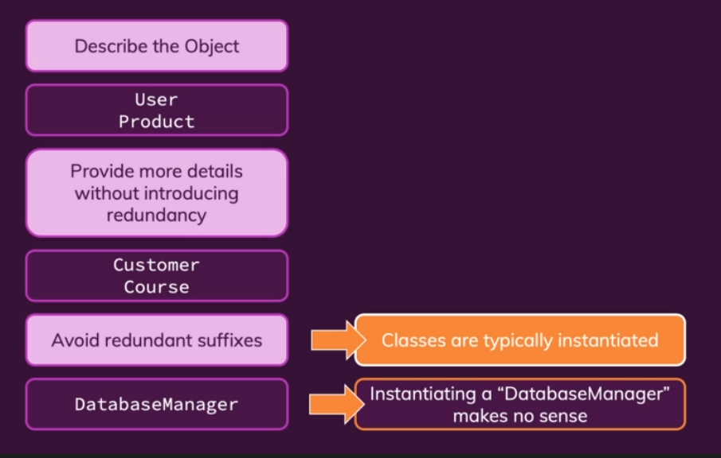
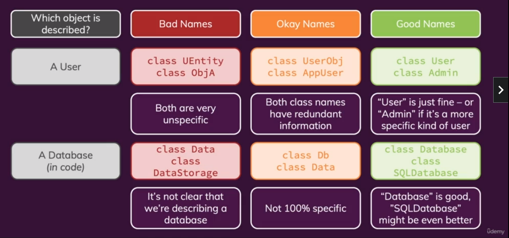

<!-- Clean Code Notes -->
# Section 1: Getting Started
`What is "Clean Code"?`
## Function that creates functions
   - Factory function or Higher Order function

&nbsp;

## What is Clean Code?
   - It is not about whether code works 
   - It is whether code is easy to read or understand
   - A vast majority of time is spent reading and understanding code
   - This is extremely helpful if it is a code to be read by multiple people 
   - If code is hard to read, effectivity and productivity levels drop
   - Create classes and functions/factory functions with better names
   - Should be readable and meaningful
   - Should reduce cognitive load

   ***Note: cognitive load refers to users' mental effort when reading software artifacts or cognitive processing tasks. For example, reading codes***

   - Should be concise and "to the point"
   - Should avoid unintuitive names, complex nesting and big code blocks
   - Should follow common best practices and patterns, concept and rules
   - Should be fun to write and to maintain

&nbsp;

## Write A Good Story! 
   - As a developer, our code is like an essay/story and we are the author
   -  Write it such that it is fun and easy to read and understand

&nbsp;
---

`Clean Code - Key Pain Points & How To Write Clean Code`
## Key Pain Points
   - Names
      * Variables
      * Functions
      * Classes
   
   - Structure & Comments
      * Code Formatting
      * Good & Bad Comments

   - Functions
      * Length
      * Parameters

   - Conditionals & Error Handling
      * Deep Nesting 
      * Missing Error Handling

   - Classes & Data Structures
      * Missing Distinction
      * Bloated Classes

***Note: Bloated classes means having too many things in a class, hence making other developers unable to understand them***

&nbsp;

#### Solutions
   - Rules & Concepts
   - Patterns & Principles
   - Test-Driven Development

&nbsp;
--- 

`How Is This Course Structured`
## Course Sections Structure
### Problems, Rules & Concepts
   - Learn about bad code and why it's bad
   - Understand the core rules and concepts to follow

### Demos & Examples
   - See bad and good code in action
   - Bad to good code transformations & examples

### Challenge
   - Analyze and transform code on your own
   - Apply what you learned

&nbsp;

## Programming Languages Used In This Course
   - Python
   - JavaScript/TypeScript

&nbsp;
---

`Clean Code & Strongly Typed Languages`

#### TypeScript add types to JavaScript

function add(num1: number, num2: number) 
{

   return num1 + num2;

}

***Types can help prevent errors and can improve readability***

***Code can also be 100% readable and meaningful without types***

def add(num1, num2):
   return num1 + num2

&nbsp;

`Functional, OOP, Procedural`
## Functional vs OOP vs Procedural
#### No matter which programming language or style we use
   - Have readable and meaningful names
   - Have slim and concise functions or methods
   - Have an understandable code flow

&nbsp;

`Clean Code vs Quick Code`
## How To Write Clean Code

&nbsp;

## Embrace Refactoring
   - A codebase can only survive and stay maintainable if it's continuously improved and refactored
   - Whenever we add something new, try to improve existing code along the way

&nbsp;

# Section 2: Naming - Assigning Names To Variables, Functions, Classes & More
`Why Good Names Matter`
## Names should be meaningful

&nbsp;
---

`Choosing Good Names`
## How To Name Things Correctly
### Variables & Constants
   - Data Containers
   - e.g. user input data, validation results, a list of products
#### Use nouns or short phrases with adjectives
   - const userData = {...}
   - const isValid = ...

### Functions/Methods
   - Commands or calculated values
   - e.g. send data to server, check if user input is valid
#### Use verbs or short phrases with adjectives
   - sendData()
   - inputIsValid()

### Classes
   - Use classes to create "things"
   - e.g. a user, a product, a http request body
#### Use nouns or short phrases with nouns
   - class User { ... }
   - class RequestBody { ... }

&nbsp;
---

`Casing Conventions & Programming Languages`
## Name Casing
### In programming, 4 main ways of name casing
   - snake_case
   - camel_case
   - PascalCase
   - kebab-case

&nbsp;

### snake_case
   - is_valid
   - send_response
   - e.g. Python
   - Variables, functions, methods

### camelCase
   - isValid
   - sendResponse
   - e.g. Java, JavaScript
   - Variables, functions, methods
   - No underscore and separation between words
   - first letter of first word is lower case
   - first letter of second word is upper case

### PascalCase 
   - AdminRole
   - UserRespository
   - e.g. Python, Java, JavaScript
   - Classes

### kebab-case 
   - < side-drawer>
   - e.g. HTML
   - Custom HTML Elements

&nbsp;
---

`Naming Variables & Properties - Theory`
## Naming Variables, Constants & Properties

&nbsp;
---

`Naming Variables & Properties - Examples`
## Examples - Variable Names

&nbsp;
---

`Naming Functions & Methods - Theory`
## Naming Functions & Methods

&nbsp;
---

`Naming Functions & Methods - Examples`
## Examples - Function/Method Names

&nbsp;
---

`Naming Classes - Theory`
## Naming Classes

&nbsp;
---

`Naming Classes - Examples`
## Examples - Class Names

&nbsp;
--- 

`Common Errors & Pitfalls`
## Don't Include Redundant Information In Names
   - Even without knowing the class definition, it's easy to guess that this user has a name and age
   
   - In general, it's expected that a "User" will contain some user data

   - We should look into the class definition if we want to learn more about the "User" object

   - Names should avoid describing unnecessary or redundant details

&nbsp;

#### user = User('Max, 31)
   (newUser, loggedInUser)

&nbsp;

## Avoid Slang, Unclear Abbreviations & Disinformation

&nbsp;

## Choose Distinctive Names

&nbsp;

## Be Consistent
   - getUsers()
   - fetchUsers()
   - retrieveUsers()

#### You can go with either of these options
#### But stick with it - throughout your entire program

&nbsp;
---  

# Section 3: Code Strucuture, Comments & Formatting
`Bad Comments`
## Bad Comments
   - Redundant Information
   - Dividers/Block Markers (Comments that mark a block of code)
   - Misleading comments
   - Commented-out Code

&nbsp;

## Good Comments
   - Legal Informtaion
   - Explanations which can't be replaced by good naming
   - Warnings
   - ToDo Notes

&nbsp;

`What is Code Formatting Really About?`
## What is "Code Formatting"?
### Code Formatting Improves Readability & Transports Meaning
   - Vertical Formatting
      * Space between lines
      * Grouping Of Code

   - Horizontal Formatting
      * Indentation
      * Space between code
      * Line width

&nbsp;

## Proper Formatting
   - Formatting is important and greatly improves readability
   - Formatting rules differ between languages
   - Follow language-specific conventions and guidelines

&nbsp;

`Vertical Formatting`
## Vertical Formatting
   - About using the vertical space in our code file
   
   - Code should be readable like an essay - top to bottom without too many "jumps"
      * Consider splitting files with multiple concepts (e.g. classes) into multiple files
      
      * A good rule to have 1 class per file

      * Different concepts("areas") should be separated by spacing

      * Similar concepts("areas") should not be separated by spacing

      * Related concepts should be kept close to each other

   - Modern IDEs offer autoformatting tools and shortcuts - even adjusted to language-specific conventions

&nbsp;
--- 

# Section 4: Functions & Methods
`Analyzing Key Function Parts`
## What Makes Up A Function?
   - Calling the function should be readable
      * The number and order of arguments matter

   - Working with the function should be easy/readable
      * The length of the function body matters

&nbsp;

## Keep The Number Of Parameters Low
   -  Minimize the number of parameters

&nbsp;

## The Number Of Function / Method Parameters
   - None 
      * user.save()
      * Easy to understand
      * Easy to call
      * Best possible option
   
   - 1 
      * log(message)
      * Easy to understand
      * Easy to call
      * Very good possible option

   - 2
      * Point (10, 20)
      * Decent to understand
      * Acceptable to call
      * Use with caution

   - 3
      * calc(5, 10, 'add')
      * Challenging to understand
      * Challenging to call
      * Avoid if possible

   - More than 3
      * coords(10, 3, 9, 12)
      * Difficult to read & understand
      * Difficult to call
      * Always avoid

&nbsp;

